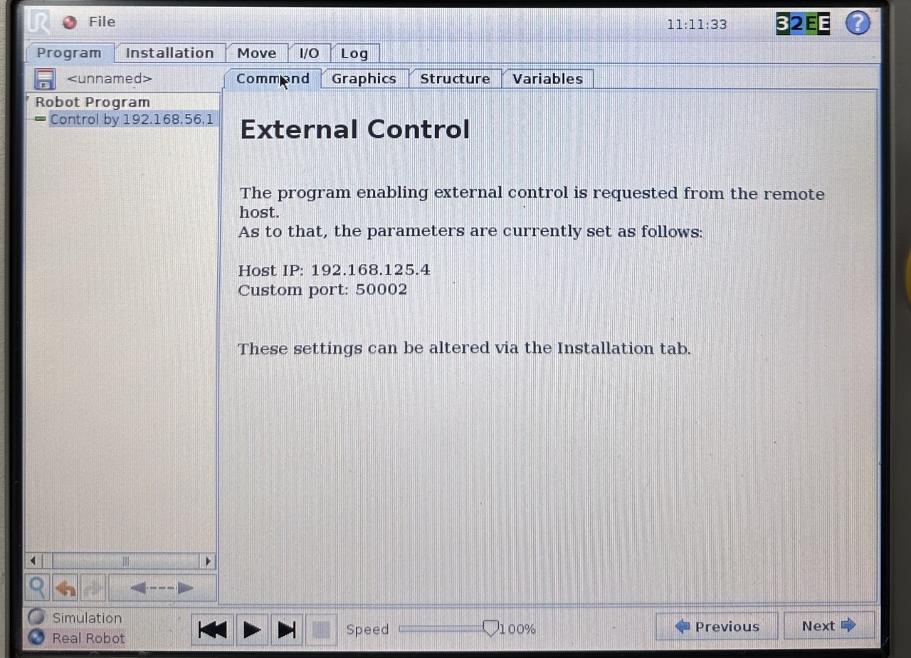
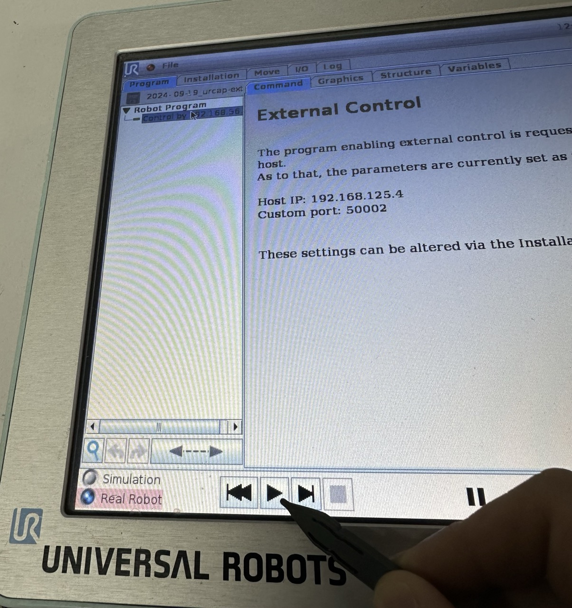
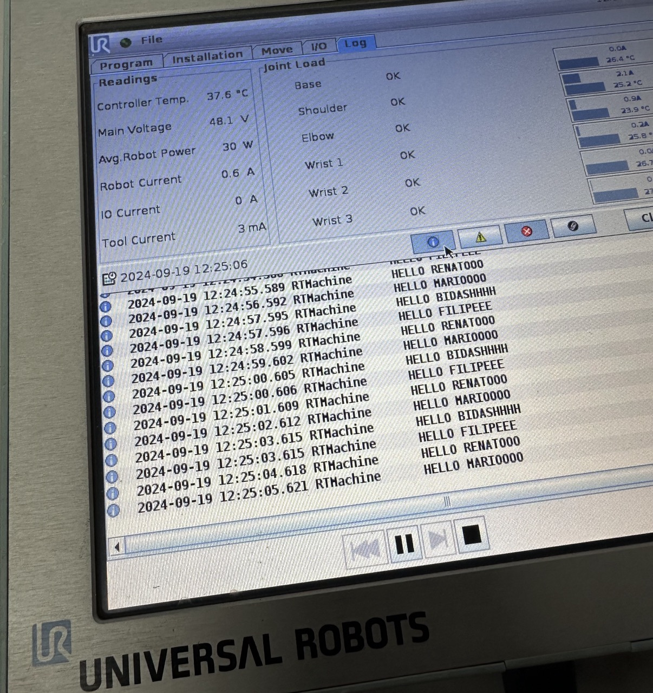

# TUTORIAL: Teste de comunicação com o braço

Neste tutorial você irá aprender como descarregar e executar um código URScript escrito computador no manipulador da UR. O tutorial foi realizado em um UR-5 CB3.

### Referências:
- [Simple External Control Server example](https://github.com/UniversalRobots/Universal_Robots_ExternalControl_URCap/tree/master/examples/simple_external_control_server)
- [Installing a URCap on a CB3 robot](https://github.com/UniversalRobots/Universal_Robots_ROS_Driver/blob/master/ur_robot_driver/doc/install_urcap_cb3.md)


***
# Passo a passo

## Conectando o robô ao computador pessoal

- [Referência](https://myur.universal-robots.com/manuals/content/SW_3_15/Documentation%20Menu/Script%20Manual/Connecting%20to%20URControl)

A conexão do computador ao robô é feito via Ethernet e TCP/IP. 

1. Primeiro, descubra o IP configurado no robô. Para isto, vá na pendant em `About`, onde irá aparece o IP atualmente configurado. 

- **NOTA:** É possível alterar o IP do robô indo em `Setup Robot > Network`.

2. Conecte a controladora via RJ-45 diretamente ao seu computador. É possível também conectá-lo a um switch.

3. Após criar um meio físico entre a controladora do UR e seu computador (cabo ethernet direto, Wi-Fi pelo switch, etc.), configure o IP da sua máquina para estar na mesma subrede (e.g., robô em `192.168.0.2` e computador em `192.168.0.3`).

4. Tente pingar o robô pelo terminal para ver se a conexão está corretamente estabelecida. 


## URCap

Para controlar o robô externamente, é necessário habilitar o URCap na pendant.

1. Sigas as instruções [deste link](https://github.com/UniversalRobots/Universal_Robots_ROS_Driver/blob/master/ur_robot_driver/doc/install_urcap_cb3.md) para instar o URCap na pendant de um braço da série CB3. 

2. Depois de instalar o URCap na pendant, vá em `Program Robot > Installation` e procure por `External Control` na aba lateral. Deve-se inserir em `Host IP` o IP do computador que vai enviar os URScripts (ou rodar os nós do ROS). Note também que há como configurar a porta em que o URCap deve procurar pelo external control no seu computador.

- **NOTA:** Esta porta pode ser confirmada em `simple_external_control_server.py` na linha:
```python
parser.add_argument("-p", "--port", type=int,
                        default=50002, help="Port number to use")
```
Neste exemplo, a porta utilizada é a `50002`.

3. Para habilitar o URCap, crie um novo programa `Empty program`, e adicione o node do URCap no código:



- **NOTA:** Ainda não é necessário executar o programa (se tentar, verá que uma mensagem de erro aparece na pendant).


## Executando o servidor no computador

Agora iremos executar o servidor no computador. O servidor em `simple_external_control_server.py` irá se conectar ao robô através do URCap e enviar para execução cíclica o URScript `hello_world.script`.

- **NOTA:** Para aprender a programar em URScript, estude [este manual online](https://myur.universal-robots.com/manuals/content/SW_3_15/Documentation%20Menu/Script%20Manual) ([versão PDF](https://myurhelpresources.blob.core.windows.net/resources/PDF/SW_3_15/scriptmanualG3.pdf)).

1. Para tal, apenas execute em sua máquina o comando:
```
python3 simple_external_control_server.py hello_world.script
```

2. Na pendant, dê `play` no programa contendo o URCap que você criou na etapa anterior.




**Pronto!** 🎉🎊👽

Se tudo correu, o código `hello_world.script` foi enviado para a pendant e neste momento está em execução cíclica no robô. Para verificar, vá na aba `Log` e clique no símbolo de informação. Você deve ser capaz de visualizar várias mensagens sendo enviadas ao log da pendant.



