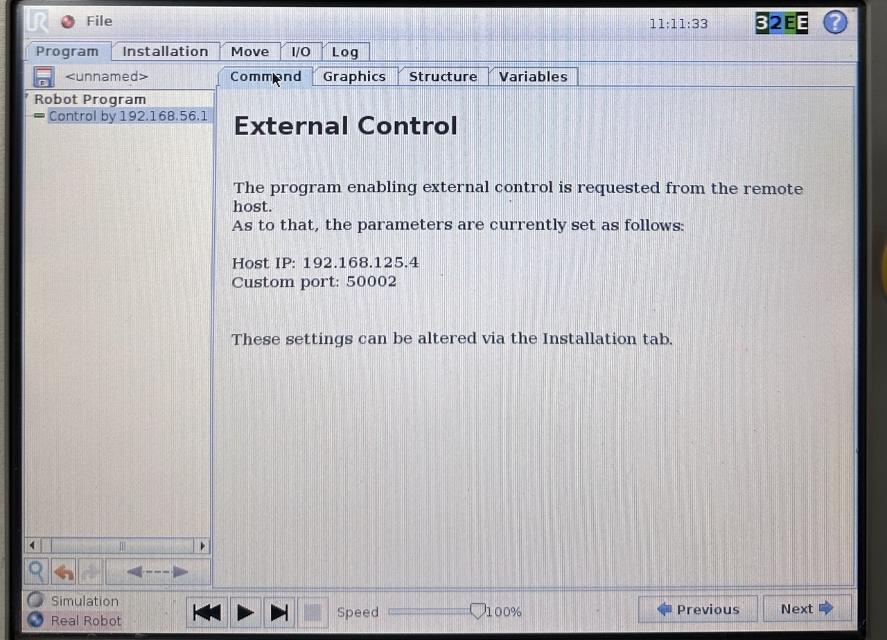

# Teste de comunicação com o braço

Neste tutorial você irá aprender como descarregar um código URScript no manipulador da UR.

Referências:
- [Simple External Control Server example](https://github.com/UniversalRobots/Universal_Robots_ExternalControl_URCap/tree/master/examples/simple_external_control_server)
- [Installing a URCap on a CB3 robot](https://github.com/UniversalRobots/Universal_Robots_ROS_Driver/blob/master/ur_robot_driver/doc/install_urcap_cb3.md)

***
# Passo a passo

## Conectando ao robô

A conexão do computador ao robô é feito via Ethernet e TCP/IP.

- [Manual](https://myur.universal-robots.com/manuals/content/SW_3_15/Documentation%20Menu/Script%20Manual/Connecting%20to%20URControl)
- **hostname:** ur-xx (xx de acordo com o modelo)
- **IP:** Pode-se encontrá-lo na seção about da pendant

Conecte seu computador à mesma rede que o robô, com um IP na mesma subrede.

Tente pingar o robô para ver se a conexão está estabelecida.

## URCap

Para controlar o robô externamente, é necessário habilitar o URCap na pendant.

Sigas as instruções [deste link](https://github.com/UniversalRobots/Universal_Robots_ROS_Driver/blob/master/ur_robot_driver/doc/install_urcap_cb3.md) para instar o URCap em um braço da série CB3. 

Depois de instalar o URCap na pendant, vá em `Program Robot > Installation` e procure por `External Control` na aba lateral. Deve-se inserir em `Host IP` o IP do computador que vai enviar os URScripts (ou rodar os nós do ROS). Note também que há como configurar a porta em que o programa deve procurar o URCap.

- Porta atual: `50002`.

Para habilitar o URCap, crie um novo programa `Empty program`, e adicione o node do URCap no código:

